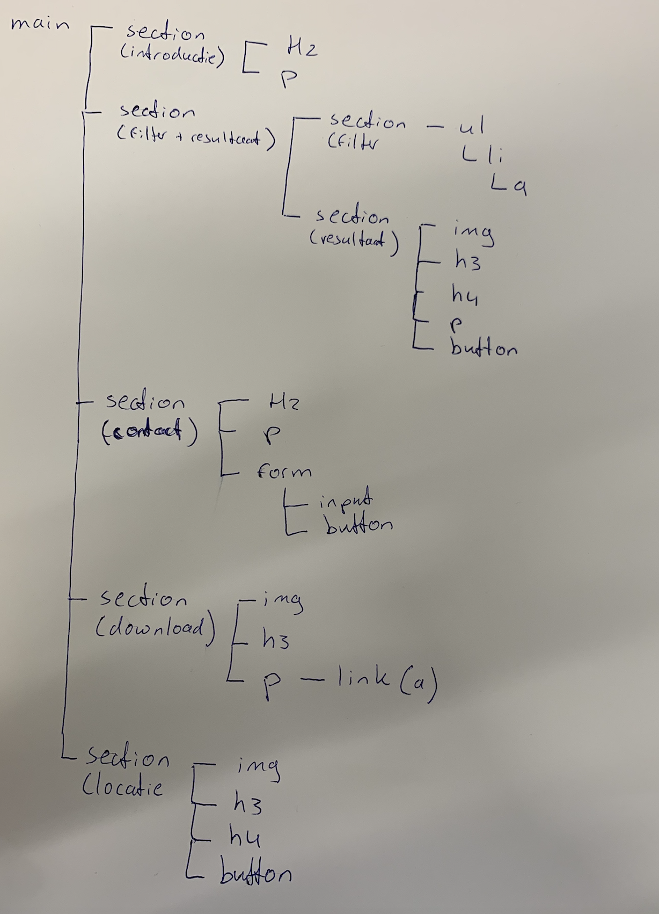
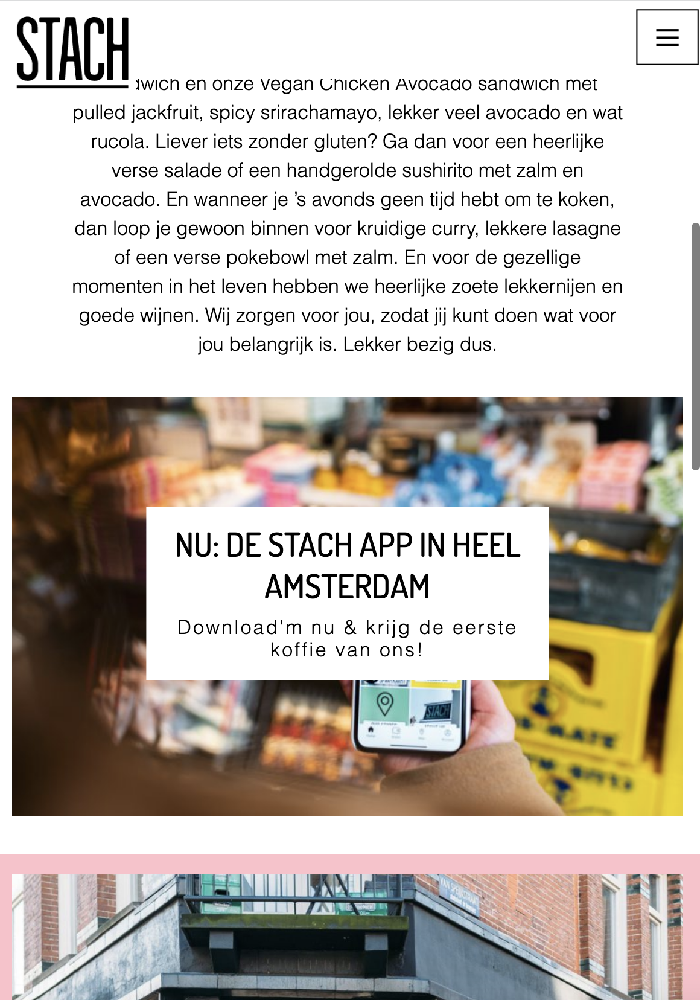
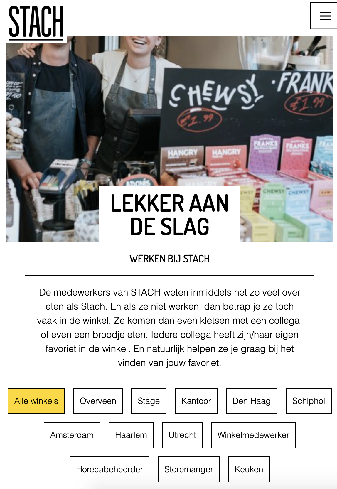
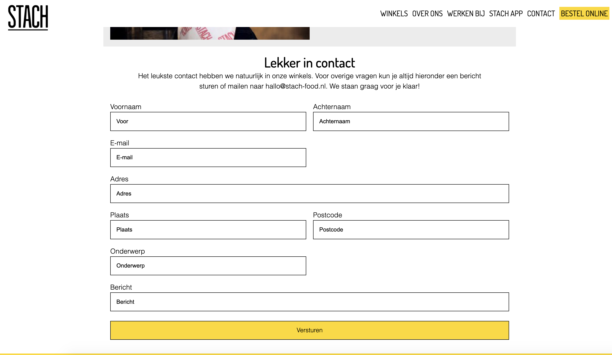
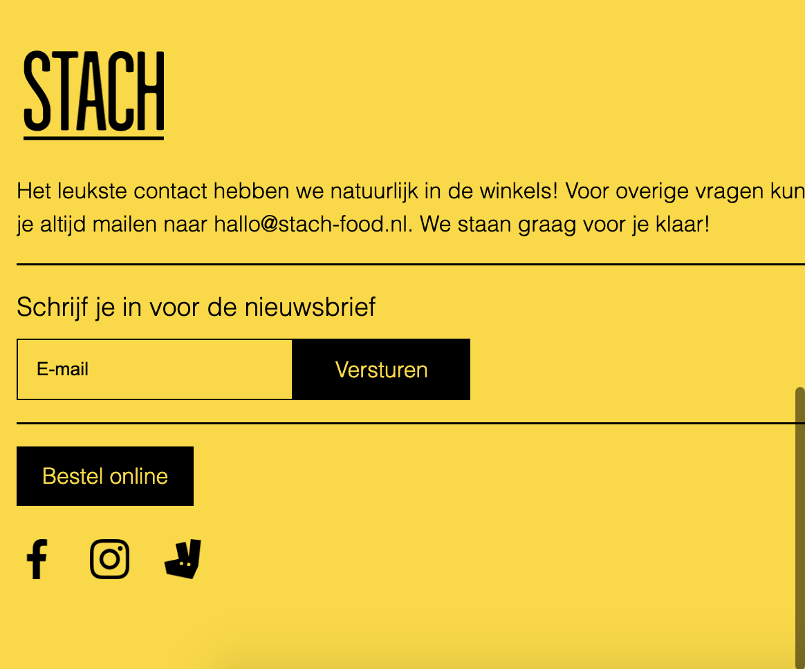

# Procesverslag
Markdown is een simpele manier om HTML te schrijven.  
Markdown cheat cheet: [Hulp bij het schrijven van Markdown](https://github.com/adam-p/markdown-here/wiki/Markdown-Cheatsheet).

Nb. De standaardstructuur en de spartaanse opmaak van de README.md zijn helemaal prima. Het gaat om de inhoud van je procesverslag. Besteedt de tijd voor pracht en praal aan je website.

Nb. Door *open* toe te voegen aan een *details* element kun je deze standaard open zetten. Fijn om dat steeds voor de relevante stuk(ken) te doen.

## Jij

  
uitwerken voor kick-off werkgroep

  ### Auteur:
  Nienke Cornielje

  #### Je startniveau:
  Blauw
  #### Je focus: responsive

## Je website

  
uitwerken voor kick-off werkgroep

  ### Je opdracht:
https://stach-food.nl/

  #### Screenshot van de homepagina (small screen):

  

  #### Screenshot van de vacaturepagina (small screen):

## Toegankelijkheidstest 1/2 (week 1)

  
uitwerken na test in 1e werkgroep

  ### Bevindingen
  Lijst met je bevindingen die in de test naar voren kwamen:

  #### Screenreader
  Het testen met de screenreader vond ik vrij lastig omdat ik was afgeleid door de stem en het systeem niet helemaal onder de knie kreeg waardoor ik het van het weekend nog een keer ga proberen.

  Hier een omschrijving van hoe het opgelost kan worden (met indien nodig afbeeldingen)

  #### Muis en Toetsenbord
  Met de muis is de website goed te bedienen  maar soms weet je niet zeker of de focus ligt op een button of link waardoor je dan per ongeluk sneller klikt.
  Helaas was dit niet zo met het toetsenbord. Door te tabben door de website en enter te gebruiken kon ik gemakkelijk door de navigatie in het menu maar vanaf daar loop je snel tegen wat problemen aan.
  1. Je weet vooral bij secties met afbeeldingen niet waar je bent/de focus op ligt.
  2. In plaats van naar een button of link toe te tabben ligt de focus op de hele sectie waardoor je niet binnen die sectie kan navigeren.
  3. Het inschrijven voor de nieuwsbrief is visueel gezien aan het einde maar wanneer je er door heen tabt aan het begin wat niet heel logisch is omdat je dan ook even de focus kwijt bent.

  De bovenstaande problemen kunnen opgelost worden een hover-state op butten en links toe te passen. Wanneer je tabt door de website op het gedeelte waar de focus op ligt bijvoorbeeld een randje omheen te laten zien en de rest moet gedaan worden in de html denk ik, dus hier ga ik naar kijken bij de Breakdownschets.

  #### Motoriek
  De website is met een slechte moteriek goed te gebruiken doordat de buttons en links aan de grote kant zijn.

  #### Visueel
  De website heb ik met alle verschillende brillen getest. e
  Er kwam uit dat het kleurcontrast ervoor zorgt dat er eigenlijk geen problemen zijn voor mensen die kleurenblind zijn maar uit de andere brillen bleek dat de tekst binnen de tekst zelf en binnen de buttons soms moeilijk te lezen was.
  Ook is er geen darkmode op de website.

  De bovenstaande problemen zouden opgelost kunnen worden door het lettertype van de tekst en in de buttons groter te maken en een darkmode te ontwerpen.

## Breakdownschets (week 1)

  ### De schets van de header van beide pagina's:
  

  ### De schets van de main met alle secties erin die verdeeld zijn over twee pagina's:
  

  ### De schets van de footer van beide pagina's:
  

## Voortgang 1 (week 2)

  
uitwerken voor 1e voortgang

  ### Stand van zaken
  hier dit ging goed & dit was lastig (neem ook screenshots op van delen van je website en code)

  ### Agenda voor meeting
  samen met je groepje opstellen

  | Nienke     | Tess         | Maeve   | Thijs        |
  | ---            | ---                | ---          | ---              |
  | Verschillende stukken code wordt gezien als link dat doorlinkt naar mijn andere html pagina, in de code kunnen we dit niet vinden | Moet ik de agenda en de filterfunctie werkend krijgen en zo niet hoe moet ik dit laten zien?             | Is de sectie 'onze producten' en 'history' een unorderd list of allemaal secties binnen de sectie?  | en dan ik dat    |
  | Is de introductie afbeelding en h1 nog een stuk van de header of niet? | dit als er tijd is | nog een punt | dit wil ik zeker |
  | Kan een h2 boven een h1 in de html omdat de h1 belangrijker is maar visueel wel onderin staat?       | ...                | ...          | ...              |

## Voortgang 2 (week 3)

  
uitwerken voor 2e voortgang

  ### Stand van zaken
  hier dit ging goed & dit was lastig (neem ook screenshots op van delen van je website en code)

  ### Agenda voor meeting
  samen met je groepje opstellen

  | Nienke    | Tess        | Maeve   | Thijs       |
  | ---            | ---                | ---          | ---              |
  | Mag je de afbeelding die je als achtergrond doet van een sectie, los in je html zetten. Dus buiten je section omdat het makkelijker is met css? | en dit             | Wanneer gebruik je welke css selectoren?  | Wanneer gebruik ik bij het indelen van mijn document een ul of een section?  |
  | Is er een manier om van bijvoorbeeld de 4e sectie(nth-of-type(4) meerdere dingen te selecteren? | dit als er tijd is | Hoe deel je css-document netjes in? | dit wil ik zeker |
  |         | ...                | Mag je bij afbeeldingen id's gebruiken?         | ...              |

## Toegankelijkheidstest 2/2 (week 4)

  
uitwerken na test in 8e werkgroep

  ### Bevindingen
  Lijst met je bevindingen die in de test naar voren kwamen:

  #### Screenreader
  Het testen met de screenreader had ik al beter onder de knie als goed is heb ik in mijn html alles kunnen labelen voor de screenreader.

  #### Muis en Toetsenbord
  Door het testen van de vorige keer wist ik dat ik me moest gaan focussen op het tabben door de website en vandaag bleek dat dat goed ging bij de linkjes, navigatie en formulieren.

  Daarnaast is door middel van de hoverstate en de focusstate ook meer duidelijkheid waar iemand nu eigenlijk is gebleven.

  #### Motoriek
  De website is met een slechte moteriek goed te gebruiken doordat de buttons en links aan de grote kant zijn.

  #### Visueel
Ik heb ervoor gekozen om niet te beginnen aan een dark-mode waardoor de website nog niet zo toegankelijk is zoals het zou kunnen zijn maar wel heb ik de contrasten binnen de buttons aangepast waardoor het voor kleurenblinden makkelijker van elkaar te onderscheiden is.

## Voortgang 3 (week 4)

  
uitwerken voor 3e voortgang

  ### Stand van zaken
  hier dit ging goed & dit was lastig (neem ook screenshots op van delen van je website en code)

  ### Agenda voor meeting
  samen met je groepje opstellen

  | Nienke      |  Tess          | Maeve   | Thijs       |
  | ---            | ---                | ---          | ---              |
  | Hoe koppel ik mijn tweede afbeelding in mijn html in de JS/CSS?  | Hoe kan ik een section goed plaatsen door middel van grid?            | Waarom zorgt font-size voor tussenruimte bij img's | Hoe kan ik goed plannen of position fixed ook handig is met responsive?  |
  | Moet ik werken met max-width of min-width met de media-querySelector? | Hoe moet ik een carousel maken met knoppen aan de zijkant? | nog een punt | dit wil ik zeker |
  | ...            | ...                | ...          | ...              |

## Eindgesprek (week 5)

  
uitwerken voor eindgesprek

  ###Conclusie Fed inschrijving 3 ;):
  
  
  
  In dit project heb ik geleerd dat coderen eigenlijk een hele leuke puzzel is. Aan het begin zie je alleen het eindplaatje waar je naartoe moet werken en je hebt eigenlijk alleen nog maar de randjes. Door de lessen krijg je wat meer stukjes die bij je elkaar kan leggen maar het echte puzzelen begint pas wanneer je er echt voor gaat zitten.
  Sinds dat moment begon ik code ook steeds leuker te vinden omdat je het overzicht begint te zien en je gerichter aan het werk kan gaan. Met wat hulp van Sanne en Jeffrey ben ik beter geworden in sneltrucjes en begin ik javascrip te begrijpen.
  Wel vind ik het soms nog lastig om met minder regels code te schrijven omdat ik dacht het fijn te vinden om het bij elk onderdeel neer te zetten wat uiteindelijk meer werk en onoverzichtelijk werkt. Hier zou ik de volgende keer meer aandacht aan willen besteden omdat het toch lekkerder werkt.
  Al met al durf ik te zeggen dat drie keer scheepsrecht is en ik het nog leuk ben gaan vinden ook

  

## Bronnenlijst

  
continu bijhouden terwijl je werkt

  - De kennis van Sanne en Jeffrey

