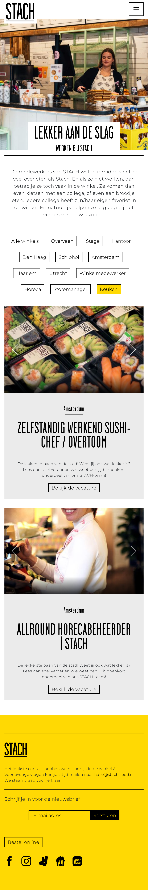

# Procesverslag
Markdown is een simpele manier om HTML te schrijven.  
Markdown cheat cheet: [Hulp bij het schrijven van Markdown](https://github.com/adam-p/markdown-here/wiki/Markdown-Cheatsheet).

Nb. De standaardstructuur en de spartaanse opmaak van de README.md zijn helemaal prima. Het gaat om de inhoud van je procesverslag. Besteedt de tijd voor pracht en praal aan je website.

Nb. Door *open* toe te voegen aan een *details* element kun je deze standaard open zetten. Fijn om dat steeds voor de relevante stuk(ken) te doen.

## Jij

  
uitwerken voor kick-off werkgroep

  ### Auteur:
  Nienke Cornielje

  #### Je startniveau:
  Blauw
  #### Je focus: responsive

## Je website

  
uitwerken voor kick-off werkgroep

  ### Je opdracht:
https://stach-food.nl/

  #### Screenshot van de homepagina (small screen):

  

  #### Screenshot van de vacaturepagina (small screen):

## Toegankelijkheidstest 1/2 (week 1)

  
uitwerken na test in 1e werkgroep

  ### Bevindingen
  Lijst met je bevindingen die in de test naar voren kwamen:

  #### Screenreader
  Hier korte omschrijving (met indien nodig afbeeldingen)
  Het testen met de screenreader vond ik vrij lastig omdat ik was afgeleid door de stem en het niet helemaal onder de knie hebben van het systeem waardoor ik het van het weekend nog een keer ga proberen.

  Hier een omschrijving van hoe het opgelost kan worden (met indien nodig afbeeldingen)

  #### Muis en Toetsenbord
  Met de muis is de website goed te bedienen  maar soms weet je niet zeker of je de focus ligt op een button of link waardoor je dan per ongeluk sneller klikt.
  Helaas was dit niet zo met het toetsenbord. Door te tabben door de website en enter te gebruiken kon ik gemakkelijk door de navigatie in het menu maar vanaf daar loop je snel tegen wat problemen aan.
  1. Je weet vooral bij secties met afbeeldingen niet waar je bent/de focus op ligt.
  2. In plaats van naar een button of link toe te tabben ligt de focus op de hele sectie waardoor je niet binnen die sectie kan navigeren.
  3. Het inschrijven voor de nieuwsbrief is visueel gezien aan het einde maar wanneer je er door heen tabt aan het begin wat niet heel logisch is omdat je dan ook even de focus kwijt bent.

  De bovenstaande problemen kunnen opgelost worden een hover-state op butten en links toe te passen. Wanneer je tabt door de website op het gedeelte waar de focus op ligt bijvoorbeeld een randje omheen te laten zien en de rest moet gedaan worden in de html denk ik, dus hier ga ik naar kijken bij de Breakdownschets.

  #### Motoriek (shocks, elastiekjes)
  De website is met een slechte moteriek goed te gebruiken doordat de buttons en links aan de grote kant zijn.

  #### Visueel (brillen, contrast, kleurenblind, dark/light).
  De website heb ik met alle verschillende brillen getest. e
  Er kwam uit dat het kleurcontrast ervoor zorgt dat er eigenlijk geen problemen zijn voor mensen die kleurenblind zijn maar uit de andere brillen bleek dat de tekst binnen de tekst zelf en binnen de buttons soms moeilijk te lezen was.
  Ook is er geen darkmode op de website.

  De bovenstaande problemen zouden opgelost kunnen worden door het lettertype van de tekst en in de buttons groter te maken en een darkmode te ontwerpen.

## Breakdownschets (week 1)

  
uitwerken na afloop 2e werkgroep

  ### De hele homepagina:
  

  ### De hele vacaturepagina:
  

  ### Een menu van een andere pagina voor de vacaturepagina (bijv filter):
  

  ### Het hamburgermenu:
  

## Voortgang 1 (week 2)

  
uitwerken voor 1e voortgang

  ### Stand van zaken
  hier dit ging goed & dit was lastig (neem ook screenshots op van delen van je website en code)

  ### Agenda voor meeting
  samen met je groepje opstellen

  | student 1      | student 2          | student 3    | student 4        |
  | ---            | ---                | ---          | ---              |
  | dit bespreken  | en dit             | en ik dit    | en dan ik dat    |
  | en dat ook nog | dit als er tijd is | nog een punt | dit wil ik zeker |
  | ...            | ...                | ...          | ...              |

  ### Verslag van meeting
  hier na afloop snel de uitkomsten van de meeting vastleggen

  - punt 1
  - punt 2
  - nog een punt
  - ...

## Voortgang 2 (week 3)

  
uitwerken voor 2e voortgang

  ### Stand van zaken
  hier dit ging goed & dit was lastig (neem ook screenshots op van delen van je website en code)

  ### Agenda voor meeting
  samen met je groepje opstellen

  | student 1      | student 2          | student 3    | student 4        |
  | ---            | ---                | ---          | ---              |
  | dit bespreken  | en dit             | en ik dit    | en dan ik dat    |
  | en dat ook nog | dit als er tijd is | nog een punt | dit wil ik zeker |
  | ...            | ...                | ...          | ...              |

  ### Verslag van meeting
  hier na afloop snel de uitkomsten van de meeting vastleggen

  - punt 1
  - punt 2
  - nog een punt
- ...

## Toegankelijkheidstest 2/2 (week 4)

  
uitwerken na test in 8e werkgroep

  ### Bevindingen
  Lijst met je bevindingen die in de test naar voren kwamen (geef ook aan wat er verbeterd is):

  #### Screenreader
  Hier korte omschrijving (met indien nodig afbeeldingen)

  Hier een omschrijving van hoe het opgelost kan worden (met indien nodig afbeeldingen)

  #### Muis en Toetsenbord
  Hier korte omschrijving (met indien nodig afbeeldingen)

  Hier een omschrijving van hoe het opgelost kan worden (met indien nodig afbeeldingen)

  #### Motoriek (shocks, elastiekjes)
  Hier korte omschrijving (met indien nodig afbeeldingen)

  Hier een omschrijving van hoe het opgelost kan worden (met indien nodig afbeeldingen)

  #### Visueel (brillen, contrast, kleurenblind, dark/light).
  Hier korte omschrijving (met indien nodig afbeeldingen)

  Hier een omschrijving van hoe het opgelost kan worden (met indien nodig afbeeldingen)

## Voortgang 3 (week 4)

  
uitwerken voor 3e voortgang

  ### Stand van zaken
  hier dit ging goed & dit was lastig (neem ook screenshots op van delen van je website en code)

  ### Agenda voor meeting
  samen met je groepje opstellen

  | student 1      | student 2          | student 3    | student 4        |
  | ---            | ---                | ---          | ---              |
  | dit bespreken  | en dit             | en ik dit    | en dan ik dat    |
  | en dat ook nog | dit als er tijd is | nog een punt | dit wil ik zeker |
  | ...            | ...                | ...          | ...              |

  ### Verslag van meeting
  hier na afloop snel de uitkomsten van de meeting vastleggen

  - punt 1
  - punt 2
  - nog een punt
  - ...

## Eindgesprek (week 5)

  
uitwerken voor eindgesprek

  ### Je uitkomst - karakteristiek screenshots:
  

  ### Dit ging goed/Heb ik geleerd:
  Korte omschrijving met plaatjes

  

  ### Dit was lastig/Is niet gelukt:
  Korte omschrijving met plaatjes

  

## Bronnenlijst

  
continu bijhouden terwijl je werkt

  Nb. Wees specifiek ('css-tricks' als bron is bijv. niet specifiek genoeg).

  1. bron 1
  2. bron 2
  3. ...

